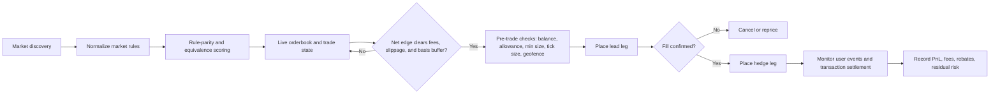
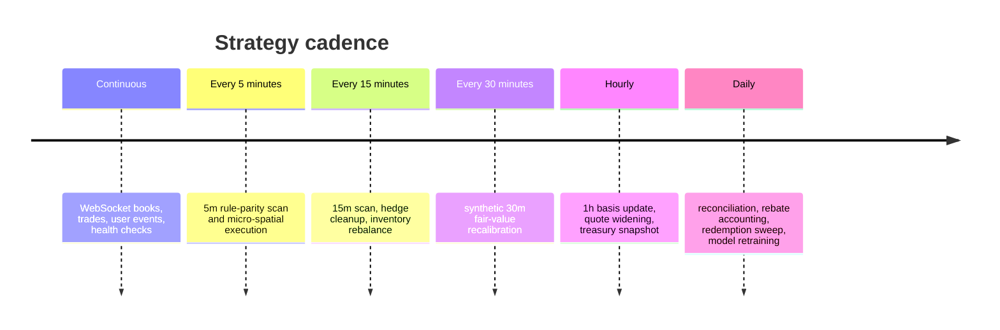

# Cross-Exchange Crypto Arbitrage Bot Research for Limitless Exchange and Polymarket

## Executive summary

A guaranteed “winning” arbitrage bot does not exist here. What does exist is a **narrow set of structurally defensible cross-venue edges** that depend on exact market-rule parity, pre-positioned capital on both chains, and disciplined execution. The most promising setup from the official sources reviewed is **short-dated spatial arbitrage on matched 5-minute and 15-minute crypto direction markets**, because current official market pages show Limitless and Polymarket both listing BTC short-window “Up/Down” markets whose examples resolve from **Chainlink BTC/USD data streams**. By contrast, current hourly and daily examples diverge materially in oracle and rule design: Limitless hourly/daily examples use **Pyth** open-price logic, while Polymarket hourly/daily BTC examples use **Binance BTC/USDT candle** logic, and at least one daily Polymarket example includes a **50-50 tie rule**. That means **5m and 15m are the best candidates for true rule-parity spatial arbitrage**, while **1h and daily are better treated as statistical relative-value or hedged market-making**, not lock-in arbitrage. citeturn33search3turn33search0turn34search0turn36search0turn33search2turn32search8turn38search0turn37search4

The main engineering constraint is **non-atomic cross-venue execution**. Limitless runs on **Base** and uses **USDC on Base** for trading; Polymarket trades on **Polygon** using **pUSD on Polygon**, an ERC-20 wrapped claim on USDC. Because the venues are on different chains and use different collateral rails, you should assume **inventory must be pre-funded on both venues**; do **not** assume you can bridge fast enough to neutralize intraday risk. Polymarket documents a bridge flow into pUSD on Polygon, while Limitless tells users to fund a Base wallet with USDC. Neither source provides deterministic “arb-safe” bridge latency for intraday use. citeturn21view1turn21view2turn21view0turn22view3

From an API surface perspective, both venues are good enough for serious automation, but Polymarket is more explicit and mature in documentation. Limitless publishes a clean REST surface for market discovery, order books, historical prices, market events, positions, PnL, allowance, and scoped HMAC tokens, but it does **not** publish numeric API rate limits in the docs reviewed. Polymarket publishes a broader split-API model with **Gamma** for market discovery, **CLOB** for order books and trading, **Data API** for positions/trades/analytics, **Bridge API** for deposits and withdrawals, detailed **rate limits**, and multiple WebSocket channels. citeturn24view0turn24view1turn23view0turn5view1turn5view2

The safest high-level recommendation is:

- **Primary strategy:** matched 5m or 15m BTC/ETH “Up/Down” spatial arbitrage only when rule-parity is exact.
- **Secondary strategy:** 1h and daily **maker-first cross-hedged market-making** or **probability spread mean reversion**, with explicit oracle/rule mismatch buffers.
- **Avoid:** any “arb” that assumes ticker/date equality is enough, any plan that needs bridging to complete the hedge, and any implementation that hard-codes fees, tick sizes, or current market templates. These are dynamic. citeturn25view0turn21view4turn39view0turn9view1turn5view12

## Exchange surface and trading interface

### API, authentication, market data, and WebSockets

The most relevant trading-facing surfaces are compared below.

| Surface | Limitless Exchange | Polymarket |
|---|---|---|
| Base URL | `https://api.limitless.exchange` | Gamma: `https://gamma-api.polymarket.com` / CLOB: `https://clob.polymarket.com` / Data: `https://data-api.polymarket.com` / Bridge: `https://bridge.polymarket.com` |
| Primary discovery endpoints | `GET /markets/active`, `GET /markets/active/slugs`, `GET /markets/{addressOrSlug}`, `GET /markets/search`, market navigation endpoints | `GET /events`, `GET /markets`, `GET /markets/{id}`, `GET /markets/{slug}`, search, tags, series, sports metadata |
| Orderbook endpoint | `GET /markets/{slug}/orderbook` | `GET /book?token_id=...` |
| Trade/event history | `GET /markets/{slug}/events` for trades, orders, liquidity changes; `GET /portfolio/history` for user history | `GET /prices-history`; Data API `/trades`; user trades endpoints; accounting snapshot ZIP |
| Historical price data | `GET /markets/{slug}/historical-price`; `GET /markets/{addressOrSlug}/oracle-candles` | `GET /prices-history`; last trade, midpoint, spread, prices endpoints |
| Order creation/cancel | `POST /orders`, cancel/batch cancel endpoints | `POST /order`, `DELETE /order`, batch post/cancel endpoints |
| WebSocket | `wss://ws.limitless.exchange`, namespace `/markets`; market prices, orderbook/trades, positions, transactions, order lifecycle | Market, user, sports, RTDS channels; public market feed and authenticated user feed |
| Auth model | Scoped HMAC API tokens with `lmts-api-key`, `lmts-timestamp`, `lmts-signature`; token derivation uses Privy identity token for partner/self-service flows | Public read endpoints; CLOB trade endpoints require L2 `POLY_*` headers; API creds derived via L1 wallet signing; orders still EIP-712 signed |

*Sources for table:* Limitless API intro and auth docs; Limitless WebSocket docs; Polymarket intro, auth, and WebSocket docs. citeturn24view0turn24view1turn14view0turn14view1turn14view11turn14view13turn5view1turn5view2turn22view6turn9view2turn9view3

Limitless’s critical public trading endpoints are well targeted: market discovery, active slugs with ticker/strike/deadline metadata, market details with venue and position IDs, order book, historical prices, oracle candles, and per-market events. The API intro also states that **public endpoints like market browsing and orderbook data do not require auth**, while trading and higher-privilege operations use HMAC-signed scoped tokens. citeturn24view0turn25view0turn15view0turn13view0turn13view2

Polymarket’s split-domain architecture matters operationally. **Gamma** is the primary discovery plane, **CLOB** is the execution and pricing plane, **Data API** is the portfolio/trades analytics plane, and **Bridge** handles deposits and withdrawals. Public read endpoints do not require auth, while CLOB trading requires L2 `POLY_*` headers and local order signing. citeturn5view1turn5view2turn22view6turn9view3

### Order types, fees, limits, and market structure

| Topic | Limitless Exchange | Polymarket |
|---|---|---|
| Market type | Prediction markets on Base; CLOB and NegRisk; YES/NO position IDs | Prediction markets on Polygon; binary markets plus Neg Risk multi-outcome structures; token IDs per outcome |
| Order types | GTC, FAK, FOK; GTC supports `postOnly`; price must be tick-aligned to `0.001` in docs reviewed | GTC, GTD, FOK, FAK; post-only only with GTC/GTD; tick sizes vary by market (`0.1`, `0.01`, `0.001`, `0.0001`) |
| Minimum order size | Orderbook response includes `minSize`; example `1` | Orderbook response includes `min_order_size`; examples show `1` and docs/examples also show market-specific minimums |
| Fees | AMM: flat `0.40%`; CLOB taker fees dynamic by price and side. Buy fees `0.40%–3.00%`; sell fees `0.42%–1.50%`; makers pay no fees | Taker-only fee formula `fee = C × feeRate × p × (1-p)`; makers pay no fees. Fee rates vary by category; Crypto shown as `0.07`, Politics/Finance `0.04`, Geopolitics `0` in the reviewed fee page |
| Maker programs | Daily USDC maker rebates; LP rewards and maker rebates documented separately | Maker Rebates Program; scorer endpoints and market-eligibility endpoints documented |
| Rate limits | Docs say to contact support for current rate limits | Published and granular: e.g. `/book` `1,500 req / 10s`, `/prices-history` `1,000 req / 10s`, `POST /order` `5,000 req / 10s` burst and `48,000 req / 10 min` sustained |
| Settlement model | Off-chain signed orders with on-chain settlement on Base; resolved state can appear before payout is redeemable on-chain | Off-chain matching with atomic on-chain settlement on Polygon; user trade lifecycle includes `MATCHED`, `MINED`, `CONFIRMED`, `RETRYING`, `FAILED` |

*Sources for table:* Limitless fees, order docs, orderbook, security, and positions docs; Polymarket trading overview, orders overview, orderbook, fees, rate limits, user channel, and CTF overview. citeturn39view0turn39view3turn14view2turn14view3turn14view4turn15view0turn21view2turn14view10turn5view9turn9view1turn22view2turn9view0turn23view0turn30search0turn21view5

For execution modeling, three facts dominate. First, **Limitless charges dynamic taker fees that are materially highest near low-probability buys and midpoint sells**, while makers are fee-free. Second, **Polymarket also uses taker-only fees**, but the fee schedule is market-category and market-object dependent. Third, **both venues support maker economics**, which means the best cross-venue design is often “maker on one venue, taker on the other,” not “double-taker.” citeturn39view0turn39view3turn9view0turn29search1turn29search4

A practical caution on Polymarket fees: the reviewed materials show **three fee representations** — the public fee page formula and category table, a `GET /fee-rate` endpoint, and a newer `feeSchedule`/`clob-markets` representation highlighted in the changelog. A production bot should therefore **query per-market fee fields live** and never hard-code only the public category table. citeturn9view0turn29search0turn29search1turn29search7

### Historical data coverage for the requested timeframes

The requested timeframes are **not equally native** across the two venues. On Limitless, the public `historical-price` endpoint documents intervals `1h`, `6h`, `1d`, `1w`, `1m`, and `all`, while the **oracle candles** endpoint supports `1m`, `5m`, `15m`, `1h`, `4h`, and `1d`. On Polymarket, `prices-history` supports `1m`, `1h`, `6h`, `1d`, `1w`, `all`, and `max`, plus a `fidelity` parameter in minutes. This means **5m and 15m can be natively supported on Limitless via oracle candles and synthetically supported on Polymarket by resampling 1m data; 30m is synthetic on both from the sources reviewed; 1h and daily are native on both**. citeturn13view0turn13view2turn22view0

For backtesting true market microstructure, neither venue’s coarse historical bars are enough by themselves. Limitless explicitly recommends WebSockets instead of polling for real-time order books and exposes `/markets/{slug}/events` for trades, orders, and liquidity changes. Polymarket similarly recommends WebSockets for real-time order book updates and offers both market data and user lifecycle streams. A serious arbitrage backtest therefore needs a **self-recorded event store** built from WebSocket snapshots/deltas plus authenticated trade/order events. citeturn15view0turn14view9turn14view11turn14view12turn9view2turn30search6turn30search0

## Operational constraints and cross-venue realities

The first hard constraint is **collateral fragmentation**. Limitless trading requires **USDC on Base**. Polymarket uses **pUSD on Polygon** for all trading and documents bridge flows that convert supported source-chain assets into pUSD on Polygon. This is not just a funding detail; it means your bot must maintain separate working inventories on both venues and treat rebalancing as a treasury process, not an execution path. citeturn21view1turn21view0turn22view3

The second hard constraint is **geography and compliance**. Polymarket’s own geographic restrictions page says the detected user location may be blocked from placing orders and explicitly lists the **United Kingdom as blocked** in the reviewed docs; it also notes special statuses like “close-only” or “frontend-only” by country. Limitless’s Terms of Service state that use is prohibited in certain jurisdictions and reserve the right to require proof of age, identity, and eligibility. Any deployable bot must put venue eligibility checks ahead of order routing. citeturn22view5turn26view0

The third hard constraint is **rule mismatch**. Prediction-market “arb” is only hard arbitrage if both contracts share the same outcome semantics, observation window, oracle, timezone, tie handling, and payout logic. That is where the reviewed market examples become decisive. Limitless’s current 5m and 15m BTC examples are Chainlink-based “Up if end price is greater than or equal to start price”; current Polymarket 5m and 15m BTC examples shown in official site results are also Chainlink-based windowed Up/Down markets. But the hourly and daily examples diverge: Limitless hourly/daily BTC examples use Pyth open-price logic, while Polymarket hourly BTC examples use Binance BTC/USDT 1-hour candles, and the reviewed daily example resolves equality as **50-50**. The implication is simple: **5m and 15m can sometimes be hard-rule mirrored; 1h and daily usually cannot**. citeturn33search3turn33search0turn34search0turn36search0turn33search2turn32search8turn38search0turn37search4

The fourth hard constraint is **latency and non-atomicity**. Polymarket discloses matching-engine server regions, a closest non-georestricted region, and even direct co-location for approved KYC/KYB users; it also exposes explicit user-channel states from `MATCHED` to `CONFIRMED`. Limitless exposes rich order and transaction streams but does not publish colocated latency guidance in the reviewed docs. In practice that means your bot must assume **legging risk**: the first leg can fill while the hedge leg moves or rejects. That makes maker-first or queue-priority strategies safer than naïve “buy here, immediately sell there” double market orders. citeturn5view11turn30search0turn28search2

## Arbitrage map and what is actually feasible

### Spatial arbitrage

**Feasible, but only selectively.** The best version is cross-venue spatial arbitrage on **same-window, same-oracle, same-rule** short-dated crypto direction markets. Based on the official market examples reviewed, **BTC 5m** and **BTC 15m** are the best candidates, and ETH may also be viable when both venues list comparable windows. The bot should normalize market rules into a canonical signature:

`{underlying, window_start, window_end, timezone, oracle, pair, comparison_op, tie_rule, payout_rule}`

Trade only when the signatures match exactly. If they do not, it is not spatial arbitrage; it is model-based relative value. citeturn33search3turn33search0turn34search0turn36search0turn25view0turn21view4

Expected edge is typically **small but real** when order books are thin, one venue lags the other, or market participants are pricing the same short window with different urgency. Because both venues are prediction CLOBs with prices from $0 to $1 and visible order books, the pure spatial spread is the difference between the best executable bid on one side and the best executable ask on the other, less venue-specific taker costs, slippage, and residual hedge risk. Your bot should reject any opportunity where the spread clears only by using stale books or by assuming full fill at top-of-book size. citeturn15view0turn22view2turn18search3

### Triangular and negative-risk arbitrage

**Mostly venue-local, only partially portable cross-venue.** Both venues support multi-outcome structures, but the conversion mechanics are **inside each venue’s own contract system**. Limitless’s NegRisk design allows traders to convert a complete set of No shares across outcomes back into collateral; Polymarket’s Neg Risk framework allows conversion of a No token into Yes tokens across other outcomes. This is useful for **intra-venue** basket arbitrage and overround compression, but it does **not** create atomic cross-venue triangular loops because the conversion legs settle in different contract domains on different chains. citeturn21view2turn21view5

That means a cross-venue “triangular” strategy is only sensible on longer horizons, where you might build a venue-local conversion trade on one side and hedge the most mispriced outcome on the other side. This is higher capital, more model-heavy, and much less appropriate for 5m or 15m. It belongs in **daily** strategy space, not intraday micro-arbitrage. citeturn21view2turn21view5

### Funding arbitrage and market-making arbitrage

**Classic funding-rate arbitrage is not available from the reviewed materials.** The official docs describe both venues as **prediction-market CLOBs**, not perpetual swaps with funding. So the correct substitute is **maker-rebate / market-making arbitrage**: post resting liquidity on one venue, hedge taker fills on the other, and let the combined edge come from spread capture plus maker economics. That is especially attractive because both venues are maker-fee-free in the reviewed materials, and both document maker incentive programs. citeturn21view2turn5view9turn39view0turn14view7turn9view0turn29search4

This is probably the strongest medium-frequency design for **1h and daily**. Instead of requiring exact rule parity, you quote conservatively on one venue around a fair value derived from the other venue and the underlying reference data; when filled, you hedge subject to a basis budget. It is less pure than spatial arb, but it is often more executable because maker economics offset some non-atomicity. citeturn14view7turn9view0turn30search1

## Strategy designs by timeframe

The table below is the most actionable design view for a bot-builder.

| Timeframe | Best strategy form | Signal logic | Entry and exit | Risk controls | Backtesting approach |
|---|---|---|---|---|---|
| 5m | **Hard-rule spatial arb** on matched BTC/ETH windows | Only trade when canonical rule signature matches exactly across venues; compute executable cross spread after all taker costs and slippage | Enter only if one leg can be maker or if both top-of-book sizes cover target size; exit by holding matched pair to resolution or flattening residual within seconds | Unhedged inventory cap very low; cancel if hedge leg not confirmed quickly; cap size to a fraction of visible depth | Self-recorded WebSocket books plus trade/order events; replay event-driven fills |
| 15m | **Hard-rule spatial arb** plus short-horizon lead/lag | Same as 5m, but allow narrower spread if liquidity is better and fill probability is higher | Enter on spread threshold; if pair becomes unmatched, flatten before the final third of the window | Slightly higher size cap than 5m, but still depth-limited and hedge-first | Same as 5m, with resampled features from 1m oracle and price history |
| 30m | **Synthetic relative value**, not pure arb | Build synthetic 30m fair value from two 15m windows or 1m/5m bars; require a much wider spread because this is model risk, not exact parity | Prefer maker-first quoting; exit on mean reversion or before the next 15m roll if unmatched | Treat as optional layer; do not force trades if no strict mapping exists | Resample Limitless oracle candles and Polymarket 1m price history; stress test with rule-mismatch penalties |
| 1h | **Cross-hedged market-making / basis trade** | Compare venue-implied probability after adjusting for oracle source, pair, and tie-rule differences; trade only when spread exceeds a basis buffer | Quote on one venue, hedge on fill on the other; avoid entering late in the hour if not already hedged | Larger mismatch buffer due to Pyth vs Binance examples; kill-switch near close if rules differ materially | Model-driven simulator with oracle-basis adjustments and user-channel state latencies |
| Daily | **Relative-value / range-basket / neg-risk hedge** | Normalize same-date threshold or directional markets; for multi-outcome markets, compare overround and basket-implied probabilities | Mostly maker-driven; hold longer; redeem or roll only after resolution criteria and payout readiness are confirmed | Wider stop and lower turnover; strict rule parser; treasury-level capital caps | End-of-day/event-driven backtests using live archive plus market metadata snapshots |

*Analytical design based on documented market structures, order types, tick sizes, WebSockets, oracle-candle availability, and current official market examples reviewed above.* citeturn13view2turn22view0turn14view3turn14view4turn9view1turn22view2turn9view2turn30search0turn33search3turn33search0turn38search0turn37search4

A useful universal decision rule is:

```text
net_edge_per_share
= executable_sell_price
- executable_buy_price
- venue_fees
- estimated_slippage
- basis_mismatch_buffer
- residual_inventory_penalty
```

And for matched, identical-rule pairs held to resolution:

```text
expected_matched_pair_pnl
= shares * net_entry_spread
+ maker_rebates
- cancellation_costs
- any unhedged residual loss
```

This formulation is necessary because the whole game is won or lost on **entry spread capture**. If the contracts are truly identical, their resolution payoff offsets; if they are not identical, you must add a **basis term** and the trade stops being pure arbitrage. The basis term should be lowest for 5m and 15m, and highest for 1h and daily, based on the official examples reviewed. citeturn33search3turn33search0turn34search0turn36search0turn38search0turn37search4

### Timeframe-specific recommendations

For **5m**, use only **strict mirror trades**. The current official market examples reviewed suggest the strongest parity here: short Chainlink-based BTC/ETH direction windows appear on Limitless, and Polymarket official site results show comparable Chainlink-based BTC 5m windows. Your target should be small, repeatable, capacity-constrained trades where one side is preferably passive and the other crosses only when edge remains after costs. This is the only timeframe where “winning through discipline” is most plausible. citeturn33search3turn34search0

For **15m**, use the same rule-parity filter, but add a **lead-lag overlay**. The extra time allows you to lean slightly more on mean reversion between venue probabilities, especially if one venue’s order flow updates faster. But do not let this become a forecasting trade; if the rule signature drifts, treat it as invalid. citeturn33search0turn36search0turn9view2turn14view11

For **30m**, do not force “arb” where the venue product surface does not support it natively. Limitless’s documented oracle candles include `5m`, `15m`, `1h`, `4h`, and `1d`, but not `30m`; Polymarket’s public price history supports `1m`, which you can resample. So 30m should be a **synthetic signal horizon** used to inform 15m/1h execution, not a mandatory standalone product. citeturn13view2turn22view0

For **1h**, the reviewed official market examples strongly suggest rule/oracle differences between venues, so the best construction is **maker-first cross-hedged quoting**. Quote where you are comfortable holding some inventory briefly, hedge after fill, and widen buffers as the window approaches close. This can work, but it is not hard arb. citeturn33search2turn38search0turn30search8

For **daily**, the best opportunities are usually **threshold/range normalization** and **multi-outcome basket relative value**, not directional micro-arb. The active-slugs metadata on Limitless exposes ticker, strike price, and deadline; Polymarket’s market model exposes outcomes, prices, and tradable market/event structures. That is enough to build a normalization layer for daily cross-platform relative-value signals, but you must heavily penalize oracle and tie-rule differences in your backtest. citeturn25view0turn21view4

## Architecture, execution flow, backtesting, and compliance

A robust implementation should be built as **two venue adapters feeding one canonical market-normalization layer**. The venue adapters handle auth, order books, order entry, and user-state reconciliation. The normalization layer turns each market into a common schema containing underlying asset, strike/range, window start/end, oracle, pair, timezone, tie rule, payout shape, and token IDs. The strategy engine should never see raw titles; it should only see normalized signatures and a confidence score for equivalence. This is the single most important architectural decision for avoiding false arbitrage. citeturn25view0turn21view4turn21view3turn24view0



This flow is directly grounded in the documented surfaces: market discovery, tick/min-size constraints, authenticated trading, user order/trade events, and venue-specific settlement/status streams. citeturn24view0turn15view0turn22view2turn9view1turn9view2turn30search0turn28search2

A practical production stack should contain these components:

| Layer | What it must do |
|---|---|
| Market discovery | Poll active markets/slugs and tags/markets; cache static token and venue metadata |
| Real-time state | Maintain in-memory books from WebSocket snapshots and deltas; detect stale feeds |
| Risk engine | Enforce max unhedged inventory, per-pair capital caps, min edge thresholds, and compliance gates |
| Execution engine | Venue-native order routers, post-only/maker logic, cancel-replace, partial-fill handling |
| Reconciliation | Persist order, fill, tx, and position lifecycles; compare venue state to internal state |
| Backtest/event store | Archive every market snapshot, trade, fill, and metadata version needed to replay decisions |
| Treasury and compliance | Separate inventory ledgers by chain/venue; geofence before routing; track redemption readiness and tax/audit logs |

*Sources informing this design:* venue metadata/token-ID docs, WebSocket docs, order and settlement docs, and geographic restrictions/eligibility pages. citeturn25view0turn14view11turn14view13turn9view2turn30search0turn14view10turn22view5turn26view0

Backtesting should be **event-driven, not OHLC-only**. For 5m and 15m, OHLC replays overstate edge because they do not capture queue position, top-of-book size, fill uncertainty, or hedge delay. Your simulator should replay: market discovery snapshots, order books, tick-size changes, your own order state, trade confirmations, venue fees, and chain-settlement states. On Polymarket, use market and user channels plus `prices-history` and trade endpoints; on Limitless, use market-price subscriptions, order events, transaction streams, oracle candles, historical-price/or events endpoints, and your own archive. citeturn9view2turn30search0turn22view0turn14view11turn15view5turn14view9

Polymarket deserves one additional operational safeguard: the **heartbeat** endpoint. The docs say that if heartbeats are not sent regularly, all open orders for the user will be automatically canceled. That is not just a feature — it is a bot-safety primitive. If you run maker inventory there, your process manager should intentionally tie heartbeat liveness to core strategy health. citeturn30search7

For cadence, use a multi-loop scheduler rather than one monolithic loop.



This cadence matches the documented native or synthetic data horizons available across the two venues. citeturn13view2turn22view0turn14view7turn9view0

## Things to avoid when handing this to a code-generation API

The most dangerous implementation errors are predictable. The table below is written deliberately as an anti-pattern guide for an automated code generator.

| Do not do this | Why it is dangerous | Correct behavior |
|---|---|---|
| Match markets only by ticker and expiry | Prediction contracts can differ in oracle, pair, timezone, tie rule, and comparison operator | Build a canonical rule signature and require exact parity for “arb” classification |
| Assume 1h or daily BTC markets are equivalent across venues | Reviewed official examples show Pyth-based Limitless hourly/daily logic versus Binance-based Polymarket hourly/daily logic; tie handling can also differ | Treat 1h/daily as relative value unless rule parity is explicitly verified |
| Bridge funds to complete the hedge | Base-to-Polygon treasury movement is not a safe intraday execution path | Pre-fund both venues and separate execution from treasury rebalancing |
| Hard-code fees or tick sizes | Limitless CLOB fees are dynamic; Polymarket fee fields are market-dependent and docs reference multiple fee representations; Polymarket tick size can change and stale values cause rejects | Query fee, min-size, and tick-size metadata live and subscribe to tick-size changes |
| Use double market orders by default | You maximize taker cost and slippage on both sides while increasing legging risk | Prefer maker on one venue and taker only where needed |
| Poll order books aggressively instead of streaming | You will trade on stale state and may exceed rate limits | Use WebSockets as the primary source of truth and REST for recovery |
| Ignore allowances and wallet mode | Both venues require approvals/allowance setup, and Polymarket’s deposit wallet path has specific signing and balance-sync requirements | Build explicit allowance checks and wallet-mode-specific bootstrapping |
| Treat “resolved” as “redeemable now” | Limitless explicitly says API-level resolved status does not guarantee on-chain payout settlement or immediate redeemability | Separate market resolution from payout redemption readiness |
| Expose secrets in client-side code | Both venues rely on sensitive signing/auth material; the docs repeatedly frame this as backend-only work | Keep keys and secrets in backend/KMS/HSM only |
| Skip geofence/compliance checks | Polymarket blocks many jurisdictions, including GB in the reviewed docs; Limitless also has jurisdiction and sanctions restrictions | Enforce venue eligibility before strategy evaluation and again before routing |

*Sources grounding these anti-patterns:* official market examples, auth docs, fee docs, WebSocket docs, allowance/approval docs, settlement docs, and geography/eligibility pages. citeturn33search3turn33search0turn38search0turn37search4turn21view0turn21view1turn39view0turn29search1turn29search7turn5view12turn14view11turn31search6turn31search8turn14view10turn22view5turn26view0

## Open questions and limitations

Several material implementation details remain either dynamic or insufficiently specified in the official materials reviewed, and your bot should treat them as runtime inputs or assumptions rather than constants. Limitless’s public docs do **not** publish numeric API rate limits; active cross-listed market overlap is dynamic and must be discovered live; 30-minute native market support is **not** documented in the reviewed Limitless data endpoints; Polymarket fee computation should be read from live market fee fields rather than static tables; and predictable bridge latency / treasury transfer SLA is not specified as an execution-grade guarantee by the reviewed venue docs. citeturn24view0turn13view2turn29search1turn29search7turn22view3

The strongest practical conclusion is therefore: **build for exact 5m/15m mirror-market arbitrage when it exists, build 1h/daily as relative-value or maker-hedging strategies, and make rule parsing the center of the system.** Anything else will look like arbitrage in a screenshot but behave like directional trading in production. citeturn33search3turn33search0turn34search0turn36search0turn38search0turn37search4